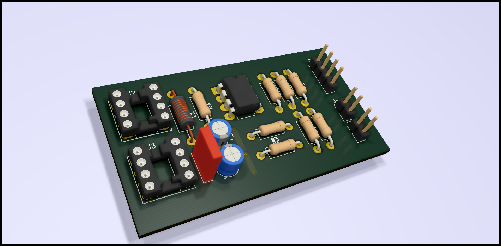

# opamp-lc-meter
Simple LC oscillator PCB design built with LM393

A replica of the oscillator section of Kerry Wong's LC meter design (http://www.kerrywong.com/2010/10/16/avr-lc-meter-with-frequency-measurement)

3D view of the board:

Note that the frequency counter section is not included in this board. This board is useful only if one has an actual (preferably more accurate than an MCU) frequency counter.

Connector usage (power, output etc.) can be deduced from the schematic.
